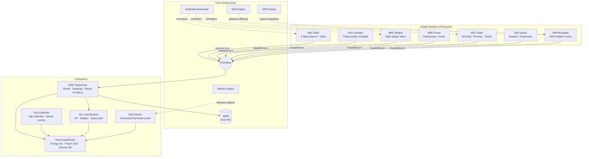

# APP ISLAMIC V2

**Flutter Android** · Local-first · Offline-capable · Indonesia

A comprehensive Islamic daily practice companion — tracks Salat, fasting, Quran recitation, Dzikir, Tahajud, and more, all wired through a single event-driven hub that powers streaks, gamification, and an AI mentor.

---

## Architecture Overview

The app is built around a **unidirectional event bus**. Every ibadah module is a producer; M08 TrackerHub is the single consumer that computes streaks and feeds the Dashboard and Gamification engine.



### Why EventBus?

Adding a new ibadah module requires **zero changes** to existing code — just publish an `IbadahEvent` to the bus. M08 picks it up automatically. This is the same pattern used in production-scale event-driven systems; here applied to a mobile app to keep modules completely decoupled.

---

## Module Map

| Module | Responsibility | Key Output |
|--------|---------------|------------|
| **M01 Salat** | 5 daily prayers, prayer times (Kemenag params), Qibla compass | `salatCompleted` event |
| **M02 Quran** | Full Quran reader, bookmarks, last-read position | `quranRead` event |
| **M04 Jumatan** | Friday prayer 7-item checklist, weekly duplicate prevention | `jumatanCompleted` event |
| **M05 Tahajud** | Last-third-of-night alarm computation, rakaat selector | `tahajudCompleted` event |
| **M06 Puasa** | Fasting log, imsak = Fajr−10min, monthly calendar | `fastingCompleted` event |
| **M07 Dzikir** | Pagi/Petang checklists, Tasbih counter with haptic feedback | `dzikirSession` event |
| **M08 TrackerHub** | Receives ALL events → streak calculation, heatmap, Pause for Mercy | Single source of truth |
| **M09 Murajaah** | Hafalan review with SRS scheduling (SM-2 algorithm variant) | `murajaahCompleted` event |
| **M10 Kalender** | Hijri calendar, Islamic event dates, Ramadan countdown | Kalender data → Home |
| **M11 Gamification** | XP system, badge unlocks, animated quest path, level formula | Journey Tab |
| **M12 Mentor** | AI-powered coach using Markov behavior model + DDA engine | Personalized tips |

---

## Screen Flow

```
App Launch
    └── Home Dashboard
            ├── Prayer card (next prayer + countdown)
            ├── Energy bar (daily ibadah score)
            ├── Streak display
            └── Heatmap "Jam Rawan"

Bottom Navigation
    ├── 🏠 Home
    ├── 🕌 Salat      → Salat Screen (prayer times, Qibla)
    ├── 📖 Quran      → Quran Screen (reader, bookmarks)
    ├── 🎯 Ibadah     → Tab: Dzikir | Puasa | Tahajud | Jumatan
    └── 🗺️ Journey    → Quest path + badges + level (Gamification)

Additional Screens
    ├── Murajaah Screen  (hafalan SRS review cards)
    ├── Kalender Screen  (Hijri calendar + Islamic events)
    └── Mentor Screen    (AI coach tips + disclaimer)
```

---

## Tech Stack

| Layer | Choice | Reason |
|-------|--------|--------|
| Framework | Flutter 3.x (Android) | Cross-platform, single codebase, native performance |
| State | Riverpod 2.x | Compile-safe, testable, no BuildContext dependency |
| Local DB | sqflite | SQLite on-device, fully offline, no backend needed |
| Prayer times | adhan (Kemenag params) | Fajr 20° / Isha 18° — Indonesian standard |
| Notifications | flutter_local_notifications | Exact alarms for prayer, imsak, tahajud |
| Localization | Flutter ARB (app_id.arb) | Zero hardcoded strings in production UI |

**Local-first by design** — no user accounts, no cloud sync, no API calls for core features. All data stays on device.

---

## Data Model (key tables)

```
ibadah_events       — append-only log of all ibadah completions (UUIDv4 PK)
salat_records       — per-prayer completion with prayer_name
fasting_log         — fasting entries with fast_type + status
dzikir_sessions     — pagi/petang session records
streak_data         — per-module streak + Pause for Mercy flag
gamification_state  — XP, level, unlocked badges
srs_items           — hafalan cards with next_review_date (SRS)
```

`ibadah_events` is **immutable** — no UPDATE or DELETE allowed (enforced via AssertionError). This preserves audit integrity and enables accurate streak recalculation from history.

---

## Build

```bash
flutter pub get
flutter analyze          # zero fatal errors
flutter test             # 21 tests, all pass
flutter build apk        # ~49.5MB release APK
```

---

## Development Process

This app was built using an **AI-orchestrated SDLC pipeline**:

1. **Architecture phase** — SRD (47 functional requirements), FDD, EFCR contracts per module, data model, RTM
2. **Execution phase** — 6 sequential Jules AI coding waves (W0 skeleton → W5 polish + APK)
3. **Quality gates** — `flutter analyze`, `flutter test`, RTM sign-off, APK size check (<50MB)

Each module was delivered as a validated, independently testable unit before integration.
